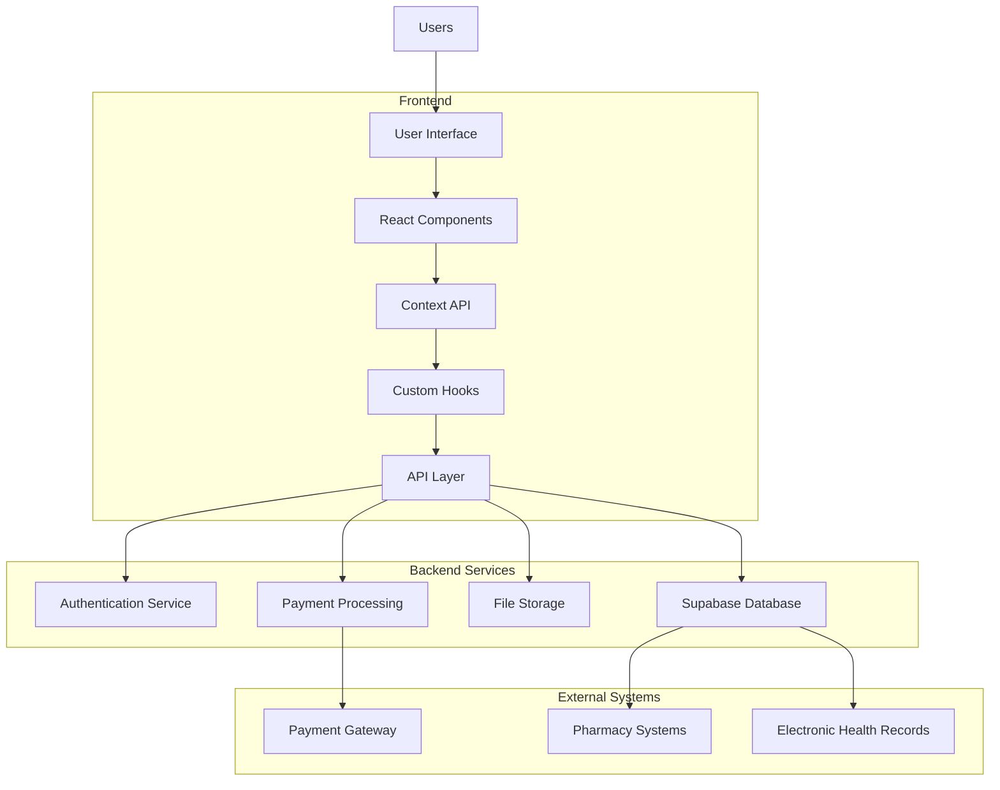
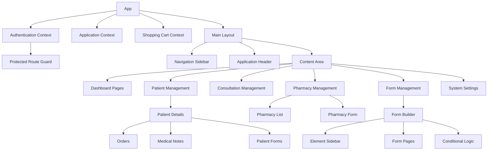
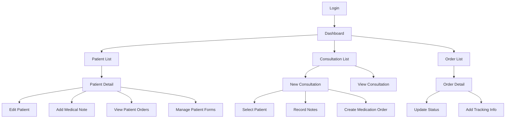

# Zappy Health Admin Dashboard - Product Requirements Document

## Overview

The Zappy Health Admin Dashboard is a comprehensive web application designed for healthcare administrators to manage patient data, consultations, pharmacy operations, and various administrative tasks. The dashboard provides a unified interface for managing all aspects of the healthcare service.

## Goals

- Streamline patient management and consultation processes
- Provide efficient tools for pharmacy and medication management
- Enable comprehensive form creation and management
- Support subscription and billing operations
- Offer robust reporting and analytics capabilities

## User Personas

### Healthcare Administrator
- Manages patient records, appointments, and administrative tasks
- Needs access to comprehensive patient data and operational metrics

### Healthcare Provider
- Conducts consultations and manages patient treatment plans
- Requires efficient access to patient medical history and medication information

### Pharmacy Manager
- Oversees medication inventory and prescription fulfillment
- Needs tools to manage pharmacy operations and medication orders

## Feature Requirements

### Authentication and Authorization

- **User Authentication**: Secure login system with role-based access control
- **Super User Mode**: Administrative override capability for system maintenance and troubleshooting
- **Role Management**: Different permission levels for administrators, providers, and support staff

### Patient Management

- **Patient Records**: Comprehensive patient profile management
- **Medical History**: Tracking of patient medical history and conditions
- **Document Management**: Upload and management of patient-related documents

### Consultation Management

- **Appointment Scheduling**: Tools for managing patient appointments
- **Consultation Notes**: Interface for recording consultation details
- **Follow-up Management**: Tracking and scheduling of follow-up appointments

### Pharmacy Operations

- **Pharmacy Management**: Tools for adding and managing pharmacy partners
- **Medication Orders**: Processing and tracking of medication orders
- **Inventory Management**: Monitoring of medication inventory levels

### Form Management

- **Form Builder**: Drag-and-drop interface for creating custom forms
- **Form Templates**: Pre-built templates for common healthcare forms
- **Form Submission**: Collection and processing of patient-submitted forms

### Subscription and Billing

- **Subscription Plans**: Management of different subscription offerings
- **Billing Operations**: Processing of payments and invoices
- **Discount Management**: Application of promotional discounts and special offers

### Reporting and Analytics

- **Operational Metrics**: Dashboards showing key performance indicators
- **Patient Analytics**: Insights into patient demographics and health trends
- **Financial Reporting**: Revenue and expense tracking

## Technical Requirements

### Frontend

- React-based single-page application
- Responsive design for desktop and tablet devices
- Component-based architecture for maintainability

### Backend

- Supabase for database and authentication
- RESTful API design
- Secure data handling compliant with healthcare regulations

### Integration

- Payment processing integration
- Electronic health record (EHR) system compatibility
- Pharmacy management system integration

## System Architecture

## Component Structure

## User Flow

## Implementation Timeline

### Phase 1: Core Infrastructure
- Authentication system
- Basic patient management
- Dashboard layout and navigation

### Phase 2: Clinical Features
- Consultation management
- Medical notes
- Form builder and management

### Phase 3: Pharmacy and Orders
- Pharmacy management
- Medication orders
- Inventory tracking

### Phase 4: Billing and Analytics
- Subscription management
- Billing operations
- Reporting and analytics

## Success Metrics

- Reduction in administrative time spent on patient management
- Increase in consultation efficiency
- Improved accuracy in medication orders
- Higher patient satisfaction with administrative processes
- Reduction in billing errors and payment processing time

## Appendix

### UI Component Library

The system uses Ant Design as the primary UI component library, supplemented with custom components for healthcare-specific functionality.

### Data Models

Key data models include:
- Patients
- Consultations
- Orders
- Pharmacies
- Forms
- Subscriptions
- Invoices

### Integration Points

- Payment gateway for processing payments
- Pharmacy systems for medication fulfillment
- Electronic health record systems for medical data exchange
