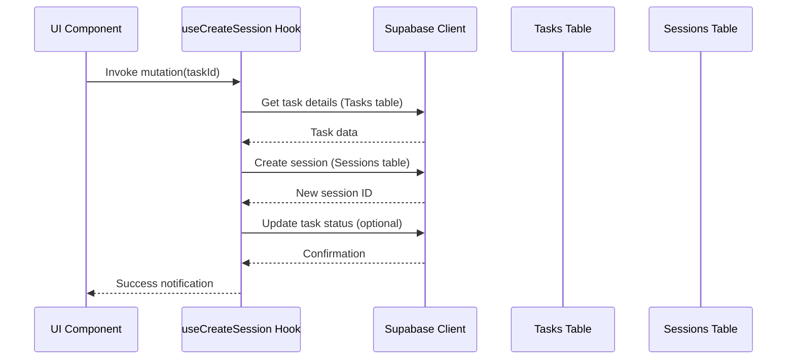
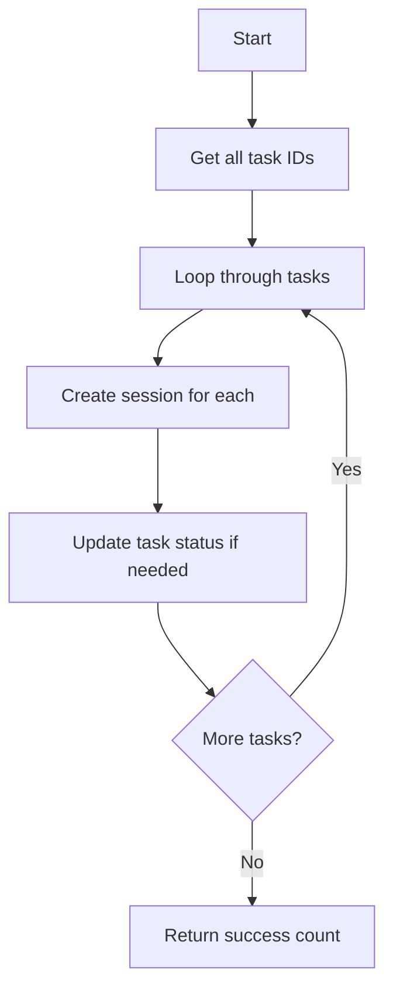

# Session Hooks Implementation Plan

## Overview
This document outlines the implementation plan for converting mocked session creation hooks to real Supabase implementations.

## Single Session Creation (useCreateSession)



### Implementation Details:
1. Fetch task details first (to get patient_id, etc.)
2. Create session with:
   ```javascript
   {
     patient_id: task.patient_id,
     scheduled_date: new Date().toISOString(),
     duration_minutes: 30,
     status: 'scheduled',
     type: 'follow_up',
     notes: `Created from task ${taskId}`
   }
   ```
3. Optionally update task status to 'converted_to_session'

## Bulk Session Creation (useCreateBulkSessions)



### Implementation Details:
1. Process in transaction
2. Return count of successful creations
3. Handle partial failures gracefully

## Next Steps
1. Implement single session creation hook
2. Implement bulk session creation hook
3. Test both implementations
4. Update documentation