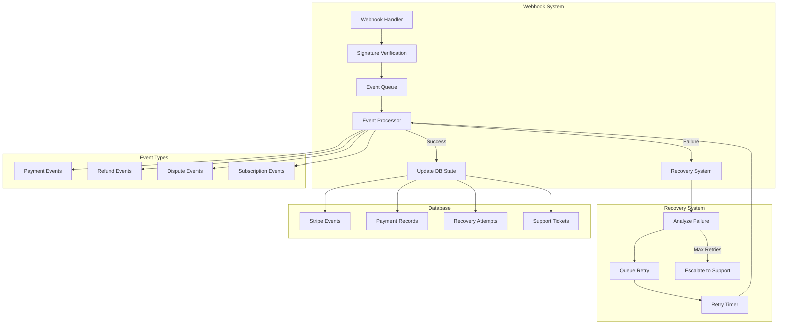
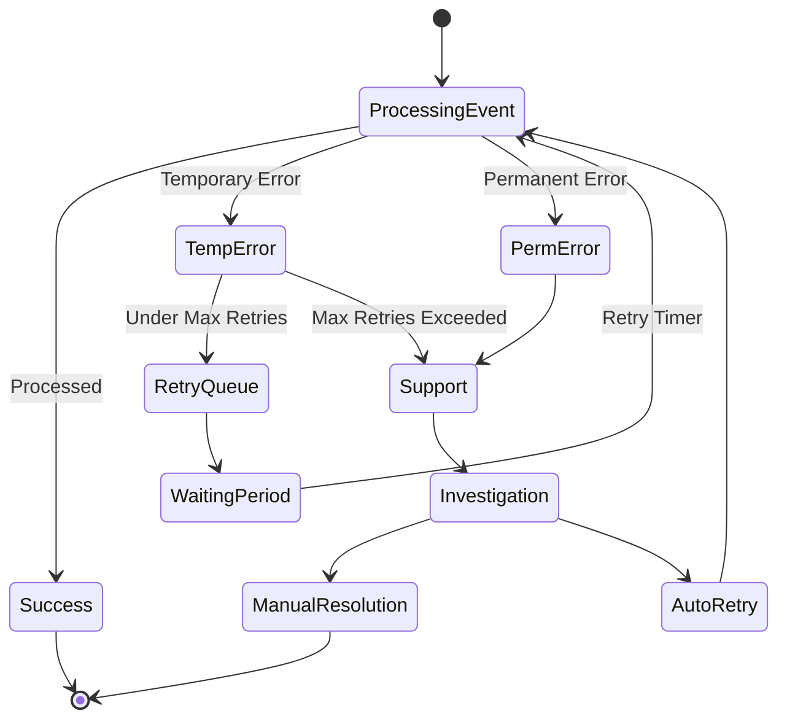

# Stripe Integration & Subscription Management Architecture Plan

## Overview

This document outlines the architecture for enhancing the Stripe integration with expanded webhook handling, improved error recovery, and robust subscription management.

## System Architecture

### Webhook System Flow


### Error Recovery Flow


## Database Schema Enhancements

### New Tables

```sql
-- For tracking refunds
CREATE TABLE stripe_refunds (
    id BIGSERIAL PRIMARY KEY,
    stripe_refund_id VARCHAR NOT NULL,
    payment_intent_id VARCHAR NOT NULL,
    amount DECIMAL(10,2) NOT NULL,
    status VARCHAR NOT NULL,
    reason VARCHAR,
    created_at TIMESTAMPTZ DEFAULT NOW()
);

-- For tracking disputes
CREATE TABLE stripe_disputes (
    id BIGSERIAL PRIMARY KEY,
    stripe_dispute_id VARCHAR NOT NULL,
    payment_intent_id VARCHAR NOT NULL,
    amount DECIMAL(10,2) NOT NULL,
    status VARCHAR NOT NULL,
    reason VARCHAR,
    evidence JSON,
    due_by TIMESTAMPTZ,
    created_at TIMESTAMPTZ DEFAULT NOW()
);

-- For support escalation
CREATE TABLE payment_support_tickets (
    id BIGSERIAL PRIMARY KEY,
    payment_intent_id VARCHAR,
    subscription_id VARCHAR,
    issue_type VARCHAR NOT NULL,
    status VARCHAR NOT NULL,
    priority VARCHAR NOT NULL,
    created_at TIMESTAMPTZ DEFAULT NOW()
);
```

### Table Modifications

```sql
-- Add columns to stripe_events
ALTER TABLE stripe_events
ADD COLUMN retry_count INTEGER DEFAULT 0,
ADD COLUMN next_retry_at TIMESTAMPTZ,
ADD COLUMN error_context JSONB;

-- Add columns to payment_recovery_attempts
ALTER TABLE payment_recovery_attempts
ADD COLUMN recovery_strategy VARCHAR,
ADD COLUMN last_error_type VARCHAR,
ADD COLUMN support_ticket_id BIGINT REFERENCES payment_support_tickets(id);
```

## Webhook Event Handling

### Additional Events to Support
1. `charge.refunded`
2. `charge.dispute.created`
3. `charge.dispute.updated`
4. `charge.dispute.closed`
5. `customer.subscription.trial_will_end`
6. `payment_intent.requires_action`
7. `invoice.marked_uncollectible`
8. `payment_method.attached`
9. `payment_method.detached`

### Recovery Strategies
1. Exponential backoff for retries
2. Different handling for different error types
3. Automatic support ticket creation
4. Notification system for critical failures

## Security Measures

1. Additional webhook signature validation
2. Rate limiting for payment attempts
3. Fraud detection rules
4. Audit logging for all payment operations

## Testing Requirements

### Unit Tests
- Webhook signature verification
- Event processing logic
- Recovery strategies
- Database operations

### Integration Tests
- End-to-end webhook processing
- Payment flow testing
- Error recovery scenarios
- Support ticket creation

### Load Tests
- Webhook handler performance
- Concurrent event processing
- Recovery system under load

## Monitoring & Alerts

1. Real-time webhook processing monitoring
2. Error rate tracking
3. Recovery success rate metrics
4. Support ticket volume alerts
5. Payment success/failure ratio monitoring

## Implementation Phases

1. Database schema updates
2. Enhanced webhook handlers
3. Recovery system implementation
4. Security enhancements
5. Testing suite development
6. Monitoring system setup

The implementation will be carried out incrementally, with each phase being tested thoroughly before proceeding to the next.