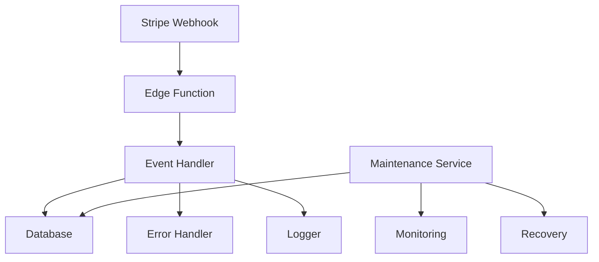
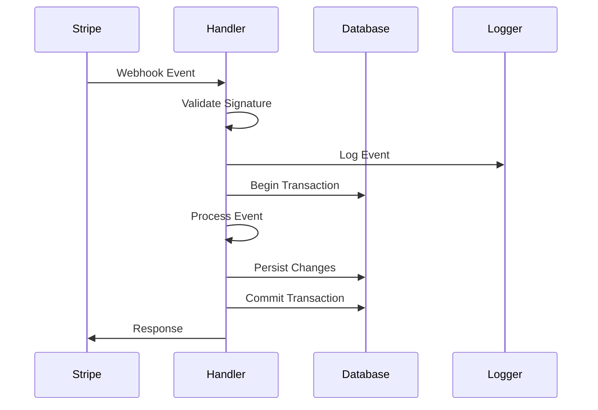
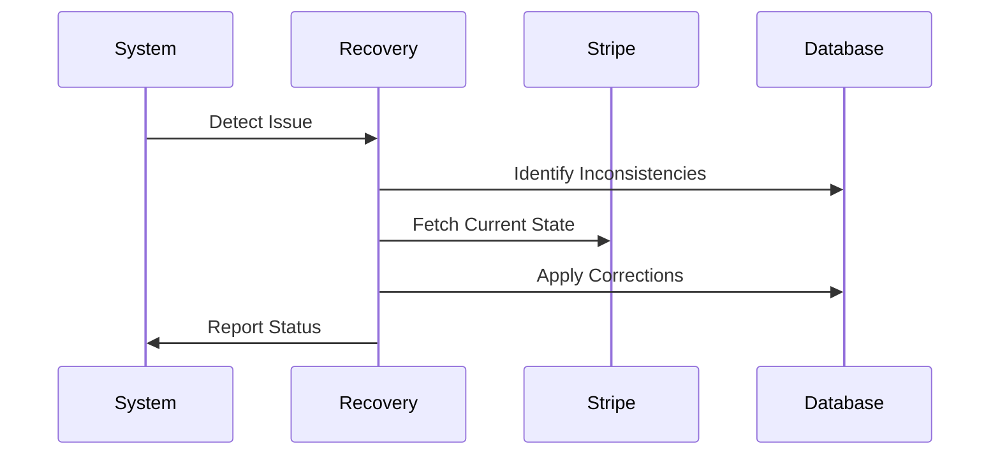

# Stripe Webhook Handler Architecture

## Overview

The Stripe webhook handler is designed as a scalable, maintainable, and resilient system for processing Stripe webhook events. It follows a modular architecture with clear separation of concerns and robust error handling.

## System Components



### 1. Core Components

#### Webhook Handler (index.ts)
- Entry point for webhook requests
- Request validation and authentication
- Event routing
- Response handling

#### Event Handler (handler.ts)
- Event type parsing and validation
- Business logic implementation
- State management
- Event processing orchestration

#### Database Layer (db.ts)
- Data persistence
- Transaction management
- Query optimization
- State consistency

#### Error Handler (types.ts)
- Error classification
- Recovery strategies
- Error propagation
- Retry logic

#### Logger (logger.ts)
- Structured logging
- Log level management
- Context tracking
- Performance metrics

### 2. Support Systems

#### Maintenance Service
- Automated health checks
- Database optimization
- Log rotation
- Cache management

#### Monitoring System
- Performance metrics
- Error tracking
- Resource utilization
- Alert generation

#### Recovery System
- Data reconciliation
- State recovery
- Error correction
- System restoration

## Data Flow

### 1. Webhook Processing



### 2. Error Recovery



## Design Patterns

### 1. Repository Pattern
Used for database operations, providing a clean interface for data access.

```typescript
class EventRepository {
  async insertEvent(event: StripeEvent): Promise<void>;
  async getEvent(eventId: string): Promise<StripeEvent>;
  async updateEvent(event: StripeEvent): Promise<void>;
}
```

### 2. Strategy Pattern
Applied for different event type handlers.

```typescript
interface EventHandler {
  canHandle(event: StripeEvent): boolean;
  handle(event: StripeEvent): Promise<void>;
}
```

### 3. Observer Pattern
Used for monitoring and metrics collection.

```typescript
interface EventObserver {
  onEventReceived(event: StripeEvent): void;
  onEventProcessed(event: StripeEvent): void;
  onError(error: Error): void;
}
```

### 4. Circuit Breaker
Implemented for external service calls.

```typescript
class CircuitBreaker {
  private failures: number = 0;
  private state: 'OPEN' | 'CLOSED' | 'HALF_OPEN' = 'CLOSED';

  async execute<T>(operation: () => Promise<T>): Promise<T>;
  private shouldRun(): boolean;
  private recordSuccess(): void;
  private recordFailure(): void;
}
```

## Error Handling

### 1. Error Classification
```typescript
interface WebhookError {
  type: string;
  code: string;
  statusCode: number;
  detail?: string;
  retry?: boolean;
}
```

### 2. Recovery Strategies
- Immediate retry for transient errors
- Delayed retry with exponential backoff
- Manual intervention for critical errors
- Automated reconciliation for data inconsistencies

## Performance Optimizations

### 1. Database
- Indexed fields for frequent queries
- Optimized table structure
- Efficient query patterns
- Connection pooling

### 2. Caching
- In-memory caching for frequent lookups
- Cache invalidation strategies
- Distributed caching considerations

### 3. Concurrency
- Parallel event processing where possible
- Resource pooling
- Rate limiting
- Load balancing

## Security Measures

### 1. Authentication
- Webhook signature verification
- API key validation
- Request origin validation

### 2. Authorization
- Role-based access control
- Least privilege principle
- Resource isolation

### 3. Data Protection
- Encryption at rest
- Secure communication
- Sensitive data handling
- Audit logging

## Monitoring & Alerting

### 1. Metrics
```typescript
interface WebhookMetrics {
  eventCount: number;
  processingTime: number;
  errorRate: number;
  successRate: number;
  responseTime: number;
}
```

### 2. Alert Conditions
- High error rate
- Slow response time
- Database issues
- Resource exhaustion
- Security violations

## Scaling Considerations

### 1. Horizontal Scaling
- Stateless design
- Load distribution
- Data partitioning
- Cache distribution

### 2. Vertical Scaling
- Resource optimization
- Performance tuning
- Memory management
- Connection pooling

## Maintenance Procedures

### 1. Routine Tasks
- Log rotation
- Database optimization
- Cache cleanup
- Metric aggregation

### 2. Emergency Procedures
- Error recovery
- Data reconciliation
- System restoration
- Incident response

## Future Improvements

### 1. Technical Enhancements
- Real-time monitoring dashboard
- Advanced analytics
- Automated recovery improvements
- Performance optimizations

### 2. Feature Additions
- Custom event handlers
- Enhanced reporting
- Webhook replay capability
- Advanced error recovery

## Dependencies

### 1. External Services
- Stripe API
- Supabase
- PostgreSQL
- Monitoring services

### 2. Internal Systems
- Authentication service
- Logging system
- Metrics collection
- Alert management

## Development Guidelines

### 1. Code Organization
- Clear module boundaries
- Consistent naming
- Documentation requirements
- Testing standards

### 2. Testing Strategy
- Unit tests for business logic
- Integration tests for workflows
- Load tests for performance
- Security tests for vulnerabilities

## Deployment

### 1. Environment Setup
- Configuration management
- Secret handling
- Resource provisioning
- Service dependencies

### 2. Release Process
- Version control
- Change management
- Rollback procedures
- Monitoring verification